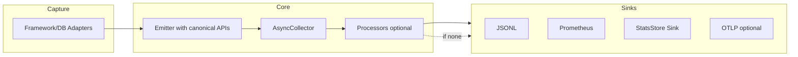

# Profilis v2 Roadmap

Consolidated plan for v2.0.0 through v2.4.0, derived from the v2 project plan and the area/direction table.

## Consolidated Plan (Table)

| Area | Problem in v1 | v2 Direction | Deliverables | Stability |
|------|----------------|--------------|--------------|-----------|
| **Event Schema** | Events are flexible dicts with no formal schema | Introduce versioned schema (`schema_version`, `profilis_version`) | Canonical event definitions and schema documentation | **Stable** |
| **Event Model** | Adapters construct payloads manually | Internal `TypedDict` contracts while keeping dicts on the wire | `profilis.core.events` module and type-safe emitter interfaces | **Stable** |
| **HTTP Event Representation** | Mixed event kinds (`REQ`, `HTTP`) across adapters | Standardize on `HTTP` event structure | Unified event fields (`method`, `route`, `status`, `dur_ns`, etc.) | **Stable** |
| **Emitter API** | Some adapters bypass emitter and enqueue directly | Provide canonical `emit_http`, `emit_fn`, `emit_db` APIs | Adapter migration and emitter documentation | **Stable** |
| **Pipeline Architecture** | Collector pushes batches directly to sinks | Introduce optional processor stage | `collector → processors → sinks` pipeline | **Experimental** |
| **StatsStore Integration** | Users manually wire collectors to StatsStore | Provide built-in StatsStore sink | Default stats aggregation pipeline | **Stable** |
| **Serialization Path** | Exporters rely on standard JSON serialization | Add faster serialization paths (e.g., orjson) | Benchmark and optional faster encoders | **Experimental** |
| **Backpressure Visibility** | Collector health metrics exist but are not standardized | Export queue depth, dropped events, failures | Prometheus and JSONL health metrics | **Stable** |
| **Multi-Worker Deployments** | Each worker runs its own collector | Document worker-local pipelines and optional shared collector mode | Deployment guide and experimental shared collector | **Experimental** |
| **Environment Configuration** | Configuration mostly done in code | Introduce environment-based configuration | `PROFILIS_*` configuration variables | **Stable** |
| **Prometheus Exporter Hardening** | Risk of high-cardinality labels | Route normalization and label allowlists | Safe metric labeling strategy | **Stable** |
| **OpenTelemetry Interop** | Profilis operates outside OTEL ecosystem | Optional OTLP exporter and context bridge | `profilis.exporters.otlp` module | **Experimental** |
| **Collector Architecture** | Thread-based collector only | Keep current design, explore external collector process | Architecture spike and design documentation | **Future** |
| **UI & Analytics** | Limited query capability in current UI | Add time windows and correlation views | Queryable StatsStore and debugging UI improvements | **Experimental** |
| **Documentation & Migration** | No formal migration guidance | Provide v1 → v2 migration guide | CHANGELOG and migration documentation | **Stable** |

---

## Release Plan (v2.0.0 → v2.4.0)

| Version | Focus | Areas | Notes |
|---------|--------|------|------|
| **v2.0.0** | Schema & event model | Event Schema, Event Model, HTTP Event Representation, Emitter API, Documentation & Migration | Breaking: deprecate `REQ` / `REQ_META`; canonical HTTP; migration guide |
| **v2.1.0** | Pipeline & operability | Pipeline Architecture, StatsStore Integration, Backpressure Visibility, Environment Configuration | Processors (experimental), built-in StatsStore sink, `PROFILIS_*` env, health metrics docs |
| **v2.2.0** | Exporters | Prometheus Exporter Hardening, Serialization Path | Route normalization, label allowlists; optional orjson (experimental) |
| **v2.3.0** | Ecosystem & UI | Multi-Worker Deployments, OpenTelemetry Interop, UI & Analytics | Deployment guide; OTLP exporter (experimental); time windows & correlation views |
| **v2.4.0** | Future / design | Collector Architecture | Design doc or spike for external collector process; no commitment to ship |

---

## Milestone Titles (for GitHub)

Use these exact titles when creating milestones or issues so scripts and project boards stay in sync:

- `v2.0.0 – Schema & Event Model`
- `v2.1.0 – Pipeline & Operability`
- `v2.2.0 – Exporters Hardening`
- `v2.3.0 – Ecosystem & UI`
- `v2.4.0 – Collector Architecture (Future)`

---

## Pipeline Diagram (v2 target)

